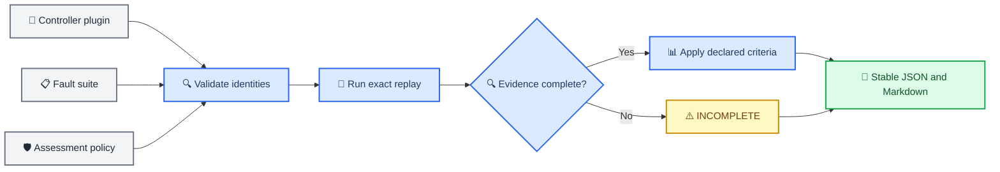

# Deterministic controller assessment reports

_Product-facing evidence from the simplified external-controller fault harness._

---

> ⚠️ **Evidence boundary:** This report assesses user-declared criteria in a simplified
> one-dimensional RPO test harness. It is not a full GNC assessment, formal verification,
> certification, or a flight-safety claim.

## 📋 Workflow

The report layer reuses the existing controller adapter and fault-suite APIs. It does not change the
controller contract, runtime profile, fault semantics, dynamics, or historical experiments.



## ⚙️ Run an assessment

The checked-in example produces both shareable formats without modifying the package or simulator:

```bash
uv run python -m kri_space_autonomy.assurance_report \
  validate-policy assessment-policies/example-rpo.json

uv run python -m kri_space_autonomy.assurance_report \
  assess kri_space_autonomy.examples.proportional_controller:controller \
  fault-suites/example-rpo.json \
  assessment-policies/example-rpo.json \
  --json-output reports/example-rpo-assessment.json \
  --markdown-output reports/example-rpo-assessment.md \
  --stdout none
```

`assess` executes two fresh fault-suite passes and requires exact replay before assessment. To assess
an existing `kri-fault-suite-result/1.0` document without rerunning the controller:

```bash
uv run python -m kri_space_autonomy.assurance_report \
  report fault-suite-result.json \
  fault-suites/example-rpo.json \
  assessment-policies/example-rpo.json \
  --stdout markdown
```

Use `--stdout json`, `--stdout markdown`, or `--stdout none`. File outputs are optional and can be
combined. Examples use project-relative output paths; local paths are never embedded in the report.

## 🛡️ Assessment policy

Policies are strict JSON with schema version `kri-assessment-policy/1.0`. Each policy binds to one
exact fault-suite ID and canonical SHA-256 identity.

```json
{
  "schema_version": "kri-assessment-policy/1.0",
  "policy_id": "my-rpo-acceptance",
  "description": "User-declared criteria for this harness run.",
  "suite": {
    "id": "example-rpo-faults",
    "sha256": "74c97631f3003431403b060c99076258c68bbf895fff9655fa27f4af72ee0408"
  },
  "default_case_requirement": "required",
  "criteria": {
    "require_success": true,
    "require_zero_collision": true,
    "minimum_propellant_remaining": {"value": 0.995, "unit": "ratio"}
  },
  "case_overrides": [
    {
      "case_id": "dropout-plus-degradation",
      "requirement": "informational"
    }
  ]
}
```

| Field | Semantics |
| --- | --- |
| `require_success` | When `true`, the case must reach the runtime-profile goal without collision |
| `require_zero_collision` | When `true`, the case must have `collision == false` |
| `minimum_propellant_remaining` | Inclusive minimum ratio in `[0, 1]` |
| `default_case_requirement` | Default `required` or `informational` role for suite cases |
| `case_overrides` | Per-case role plus optional partial criterion overrides |

Unspecified per-case criteria inherit the global criteria. Override array order and JSON formatting do
not change the normalized policy identity. Duplicate keys, unknown fields, unknown suite cases,
booleans used as numbers, malformed hashes, wrong units, and NaN or infinity fail closed.

## 📊 Decisions and exit status

| Assessment | Meaning | CLI exit |
| --- | --- | ---: |
| `PASS` | Every required case is present and passes every enabled declared criterion | `0` |
| `FAIL` | Evidence is complete, but one or more required cases fail declared criteria | `1` |
| `INCOMPLETE` | At least one declared suite case result is missing | `1` |
| `INVALID` | Controller, suite, policy, result, compatibility, execution, or output is invalid | `2` |

A valid `FAIL` or `INCOMPLETE` still produces JSON and Markdown. An invalid run emits a
`kri-assurance-error/1.0` JSON object to standard error and never receives a `PASS` label.

## 📦 Report evidence and identity

The stable JSON and Markdown bind:

- controller ID, version, contract, import specification, and module SHA-256
- fault-suite ID, canonical SHA-256, runtime profile, result schema, and result SHA-256
- assessment-policy ID, schema, and normalized SHA-256
- each case definition hash, case-result hash, command-trace hash, and fault sequence
- each declared criterion, observed value, result, role, and explanation
- one overall report fingerprint over the complete substantive payload

Per-case evidence is limited to signals already produced by the public fault-suite result: success,
collision, final range and speed, propellant remaining, steps, commands, degraded and missing
observation counts, and actuator-modified command steps. When the suite has exactly one fault-free
case, the report adds direct numeric deltas against that nominal result.

The payload contains no timestamps. Repeating `assess` with the same controller source, suite,
policy, and supported runtime must produce the same JSON payload, Markdown, and report fingerprint.

## 🔧 Python API

```python
from kri_space_autonomy.assurance_report import (
    assess_controller,
    assess_fault_suite_result,
    load_assessment_policy,
    render_report_json,
    render_report_markdown,
)
from kri_space_autonomy.fault_suite import load_fault_suite, run_fault_suite

controller = "my_controller:controller"
suite = load_fault_suite("fault-suites/example-rpo.json")
policy = load_assessment_policy("assessment-policies/example-rpo.json")

replayed_report = assess_controller(controller, suite, policy)
existing_result = run_fault_suite(controller, suite)
offline_report = assess_fault_suite_result(existing_result, suite, policy)

json_text = render_report_json(replayed_report)
markdown_text = render_report_markdown(offline_report)
```

## ⚠️ Limitations

- The environment is a simplified one-dimensional RPO test harness, not a simulator of record
- The controller boundary is local and in-process, not a process sandbox
- The report does not establish full-GNC performance or operational fault prevalence
- The report does not claim formal verification, certification, or flight safety
- The external-controller result exposes no runtime-assurance intervention count or generic
  controller-internal corruption evidence, so the report does not invent either signal
