# Experiment 002 research plan

_Design protocol for KRI Space Autonomy Lab v0.2; amended before the design-validation pilot_

---

## Approved pilot amendment

The 9,600-episode pilot is canonical at four arms, six strata, and 400 paired seeds per stratum. The six equal-weight strata are nominal; primary navigation; monitor-only navigation; shared-cause navigation; persistent model upset; and actuator degradation. The three navigation strata each use an exact 50/50 bias/dropout mixture.

Controller arms share initial conditions and named exogenous innovations, never a controller-dependent latent truth trajectory. Each arm propagates its own truth from its executed commands. The offline safety evaluator is structurally independent of the runtime gate and uses hidden truth with actuator lag, latent effectiveness, adverse bounded disturbance, propellant-limited reachable stopping, exact interval extrema, and continuous collision detection. Numerical propagation verification holds controller timing fixed; separate `1/0.5/0.25 s` runs measure command-rate sensitivity.

Before pilot execution, the implementation must freeze and hash the policy architecture, ordered features, missing-value handling, action transform, training objective, optimizer budget and seed, validation-only model-selection rule, recovery precedence, calibration corridor, all seed/scenario manifests, progression criteria, and append-only amendment rules. The full 32,000-episode confirmatory campaign remains out of scope.

## 📋 Planning assumptions and scope

The planning interview received no response, so this document uses three recommended assumptions that remain open for correction before approval:

- **Confirmatory scale:** 1,000 independent scenario seeds per fault stratum
- **Monitor comparison:** both shared-input and equal-spec dual-channel protected controllers
- **Learned baseline:** one frozen independently trained lightweight policy, plus training-seed sensitivity as a secondary analysis

Experiment 002 remains a one-dimensional synthetic proximity-operations study. Its target population is the stochastic generator defined below, not operational spacecraft or real fault prevalence. Equal weighting across fault strata defines a stress-test estimand, not a claim about how often faults occur in flight. The design responds directly to the completed [Experiment 001 reproduction report](experiment-001-reproduction/REPORT.md).

### Design objective

Experiment 002 should test the runtime-assurance architecture rather than merely test whether a rule reproduces its own envelope. It must therefore:

- replicate independent scenario seeds at the episode level
- prevent all controllers and monitors from accessing simulator truth
- separate command mediation from extra sensor redundancy
- score safety from hidden physical truth using metrics not used by the gate
- use a fixed evaluation horizon and episode-level inference
- load a frozen learned-policy artifact rather than fitting one per episode
- add limited stochastic sensing, process disturbance, and actuator dynamics without moving to full orbital simulation
- freeze dependencies, seeds, policy artifacts, configuration, and analysis before the confirmatory run

```mermaid
flowchart LR
    accTitle: Experiment 002 evidence pipeline
    accDescr: Design flow from frozen policy and seeded stochastic scenarios through paired controller runs, independent truth-based scoring, locked analysis, and an approval decision

    freeze_policy[🔒 Freeze policy] --> seed_manifest[📋 Freeze seed manifest]
    seed_manifest --> paired_runs[🧪 Run paired controllers]
    paired_runs --> truth_metrics[📊 Score hidden truth]
    truth_metrics --> locked_analysis[🔍 Run locked analysis]
    locked_analysis --> decision{📋 Gates passed?}
    decision -->|Yes| report_pass[✅ Report favorable]
    decision -->|No| report_fail[⚠️ Report fail or inconclusive]

    classDef process fill:#dbeafe,stroke:#2563eb,stroke-width:2px,color:#1e3a5f
    classDef decision_style fill:#fef9c3,stroke:#ca8a04,stroke-width:2px,color:#713f12
    classDef success fill:#dcfce7,stroke:#16a34a,stroke-width:2px,color:#14532d
    classDef caution fill:#fee2e2,stroke:#dc2626,stroke-width:2px,color:#7f1d1d

    class freeze_policy,seed_manifest,paired_runs,truth_metrics,locked_analysis process
    class decision decision_style
    class report_pass success
    class report_fail caution
```



## 🎯 Research question and hypotheses

### Research question

Within a prespecified stochastic population of one-dimensional proximity approaches with noisy navigation, bounded disturbances, and single or combined faults, does runtime assurance reduce physical safety failures for the same frozen learned policy while preserving sustained mission completion, when the monitor receives either the same estimate as the policy or an equal-spec independent estimate and never receives simulator truth?

### Primary estimands

The experimental unit is one `fault_stratum × root_seed` scenario. All controller arms share the same initial condition, named exogenous disturbance innovations, sensor innovations and latency draws, and fault realization. Each arm propagates its own controller-dependent truth trajectory; observations are generated from that arm's truth plus the shared exogenous innovations.

Let `D` be learned direct control, `PS` protected shared-input control, and `PD` protected dual-channel control. For each controller, calculate the equal-weight mean of its stratum-specific episode risks.

- **Safety effect:** paired risk difference `RD_hazard = P(hazard_PD) - P(hazard_D)`
- **Mission effect:** paired risk difference `RD_success = P(success_PD) - P(success_D)`
- **Mediation effect:** `P(hazard_PS) - P(hazard_D)`
- **Independent-channel increment:** `P(hazard_PD) - P(hazard_PS)`

### Confirmatory hypotheses

1. **H1 — safety superiority:** `PD` has lower physical-hazard risk than `D`
2. **H2 — mission noninferiority:** conditional on H1 passing, sustained mission success for `PD` is not more than 3 percentage points worse than `D`
3. **H3 — same-information mediation:** `PS` versus `D` estimates whether gating helps without added information
4. **H4 — independent-channel contribution:** `PD` versus `PS` estimates the additional effect of an equal-spec independent observation channel
5. **H5 — fault recovery:** `PD` increases recovery-by-deadline probability or reduces restricted mean time unrecovered versus `D`

H1 and H2 form the confirmatory gatekeeping sequence. H3–H5 are secondary and must not rescue a failed primary result.

### Rival explanations to discriminate

- Protection helps because unsafe learned commands are intercepted
- Apparent protection helps only because the monitor receives a second sensor channel
- Protection fails under shared-cause or monitor-channel faults
- Improvements are peculiar to one trained policy artifact
- Improvements trade safety for excessive fallback, propellant use, or mission failure

## ⚙️ Experimental design and controller factors

### Controller arms

| Arm | Controller | Policy input | Monitor input | Inferential role |
|---|---|---|---|---|
| `R` | Deterministic reference | Primary estimate | None | Descriptive benchmark |
| `D` | Frozen learned direct | Primary estimate | None | Primary comparator |
| `PS` | Protected shared-input | Primary estimate | Same primary estimate | Isolates mediation |
| `PD` | Protected dual-channel | Primary estimate | Equal-spec independent estimate | Primary architecture |

The hidden truth state is available only to the dynamics engine and offline outcome evaluator. `PS` and `PD` must call the same frozen learned artifact and propose identical learned actions before gating for any common primary observation.

### Fair-monitor rules

- Primary and monitor channels use identical nominal noise, quantization, update rate, and latency distributions
- Independent innovations are used in `PD` except in a declared shared-cause stratum
- `PS` receives exactly the primary estimate, not a copied truth state
- The gate receives only its declared observation, model-integrity status, and internal state
- Fault labels, true fault severity, true actuator effectiveness, and true spacecraft state are prohibited gate inputs
- Offline metrics may use truth but may not feed results back during an episode

### Design structure

This is a paired, blocked Monte Carlo experiment:

- Block on fault stratum
- Pair all controller arms on each materialized root seed
- Randomize arm execution order within each block
- Use common random numbers through named exogenous streams
- Treat controller crashes, invalid actions, numerical failures, collisions, and timeouts as adverse episode outcomes
- Rerun only infrastructure failures established without reference to controller outcome; rerun the entire four-arm block with the identical seed and retain both attempt logs

### Fixed timing

- Command and observation interval: `1 s`
- Evaluation horizon: `600 s`
- No early termination for first goal entry
- Collision becomes an absorbing failed state
- Fault timing is expressed in seconds, not iteration indices
- A convergence subset is later repeated at `0.5 s` and `0.25 s` while preserving physical fault times

## 📊 Stochastic population, faults, and seeds

All values below are v0.2 engineering stress-test assumptions. They require KRI domain-owner approval before the protocol is frozen and must not be described as flight-calibrated distributions.

### Common episode distributions

| Factor | Distribution | Unit | Purpose |
|---|---|---:|---|
| Initial range | `Uniform(80, 120)` | m | Approach variation |
| Initial velocity | `TruncatedNormal(-0.15, 0.05², [-0.30, 0])` | m/s | Closing-rate variation |
| Initial propellant | `Uniform(0.85, 1.00)` | fraction | Resource variation |
| Range noise | `Normal(0, 0.25²)` | m | Each sensor channel |
| Velocity noise | `Normal(0, 0.01²)` | m/s | Each sensor channel |
| Sensor latency | `0 s` with 0.9; `1 s` with 0.1 | s | Equal channel specification |
| Process acceleration | `Normal(0, 0.002²)`, clipped `±0.006` | m/s² | Bounded disturbance |
| Actuator time constant | `0.5` | s | First-order lag |

Noise is sampled independently by channel unless a fault explicitly introduces correlation. The process disturbance is piecewise constant within each command interval.

### Confirmatory fault strata

Use eight equal-weight strata, each with 1,000 confirmatory root seeds:

| ID | Fault stratum | Sampled parameters | Essential contrast |
|---|---|---|---|
| `F0` | Nominal stochastic | Common noise and disturbance only | False handover and availability |
| `F1` | Primary range bias | Onset `U(120,300)s`; duration `U(30,120)s`; signed magnitude `U(5,30)m` | Independent monitor benefit |
| `F2` | Primary dropout | Onset `U(120,300)s`; duration `U(5,30)s` | Missing-navigation resilience |
| `F3` | Monitor-channel fault | Bias or dropout with F1/F2 ranges, monitor only | Monitor-induced harm control |
| `F4` | Shared-cause navigation fault | Both channels; signed bias `U(5,20)m` or dropout `U(5,15)s` | Non-ideal redundancy |
| `F5` | Persistent model upset | Onset `U(120,300)s`; eligible weight and signed normalized magnitude `U(2,6)` | Integrity handover |
| `F6` | Actuator degradation | Onset `U(120,300)s`; duration `U(30,150)s`; effectiveness `U(0.25,0.75)` | Robustness after gate |
| `F7` | Combined fault | Primary dropout plus actuator degradation; onset gap `U(-30,30)s` | Modest combined stress |

Model-upset magnitude is expressed in units of a parameter-scale value frozen in the policy manifest, not as an unscaled raw delta. The in-memory working copy is perturbed identically for `D`, `PS`, and `PD`; the frozen artifact is never altered.

### Seed and random-stream plan

Use NumPy `SeedSequence` with a recorded bit generator and domain-separated stream identifiers. A recommended deterministic key is:

```text
(master=2002, partition, fault_stratum, replicate, stream)
```

Named streams:

- `initial_state`
- `process_disturbance`
- `primary_sensor`
- `monitor_sensor`
- `fault_parameters`
- `arm_run_order`

Partitions must be disjoint and materialized before use:

| Partition | Recommended size | Permitted use |
|---|---:|---|
| Policy train-fit | 2,000 seeds | Optimization and preprocessing |
| Policy train-stop | 500 seeds | Early stopping only |
| Policy validation | 500 seeds | Candidate selection only |
| Metric calibration | 500 seeds | Freeze the operational corridor only |
| Experiment pilot | 400 per stratum | Generator QC and power simulation |
| Confirmatory test | 1,000 per stratum | One locked evaluation |

No confirmatory seed may be regenerated, replaced, or added after unblinding unless a formal amendment is approved; amended results are then labeled non-confirmatory.

## 📈 Outcomes and metric definitions

### Independent primary safety endpoint

Define the truth-based physical braking margin:

```text
M(t) = r_true(t) - r_collision
       - max(0, -v_true(t))² / (2 × a_separation_available(t))
```

where `r_collision = 1 m` and `a_separation_available(t) = a_max × effectiveness(t)` is the maximum separating acceleration physically available under the latent actuator state, independent of the commanded action. This quantity is not supplied to the monitor.

An episode has a **physical hazard event** if either condition occurs:

- continuous true range reaches `≤1 m`
- braking margin is `<0` for at least `1 s`

Collision and interval minima must be evaluated continuously within each command interval, including interior extrema, rather than only at sampled endpoints. Report collision separately even when the composite endpoint is used.

### Sustained mission success

An episode is successful only if all criteria hold:

- no physical hazard event
- propellant never reaches zero and final propellant is at least the `0.10` reserve
- true range remains between `5 m` and `8 m`
- absolute true relative velocity remains `≤0.06 m/s`
- the range and velocity conditions hold continuously for the final `60 s` of the `600 s` horizon

First goal entry is recorded but is not success. All non-collision episodes run to the common horizon.

### Recovery state machine

Create a controller-independent operational corridor from a separate calibration partition; freeze its definition before the confirmatory seeds are opened. It must use truth only for offline scoring and must not duplicate `SafetyEnvelope`.

Classify each faulted episode as:

- `UNAFFECTED`: never leaves the operational corridor after fault onset
- `RECOVERED`: leaves the corridor, re-enters within `180 s`, remains for `30 s`, and later achieves sustained mission success
- `GRACEFUL_DEGRADED`: persistent fault remains, learned authority is not restored, but sustained mission success is achieved safely under fallback
- `NOT_RECOVERED`: none of the above by the horizon
- `FAILED`: collision, physical hazard, propellant depletion, invalid action, controller failure, or numerical failure

Recovery time begins at the first post-fault corridor exit and ends at the start of the qualifying 30-second re-entry window. Persistent model corruption may be graceful degradation but is never labeled recovered unless the model itself is restored.

### Primary and secondary metrics

| Priority | Metric | Unit of analysis | Effect measure |
|---|---|---|---|
| Primary | Physical hazard by horizon | Episode | Paired risk difference |
| Primary | Sustained mission success | Episode | Paired risk difference |
| Key secondary | Recovery by 180 s | Faulted episode | Paired risk difference |
| Key secondary | Restricted mean time unrecovered | Episode | Paired difference in seconds |
| Secondary | Collision | Episode | Risk difference and upper bound |
| Secondary | Minimum braking margin | Episode | Paired median and 5th-percentile difference |
| Secondary | Minimum continuous range | Episode | Paired median difference |
| Secondary | Distinct handover episodes | Episode | Paired count difference |
| Secondary | Fallback duty cycle | Episode | Difference in time fraction |
| Secondary | Propellant used | Episode | Paired mean/median difference |
| Secondary | Final-60-second goal dwell | Episode | Difference in time fraction |

`interventions` must mean transitions into fallback. Time spent overridden is reported separately as fallback duty cycle.

## 🔍 Repetitions, power, and statistical analysis

### Recommended repetitions

Use 1,000 confirmatory root seeds in each of eight fault strata. With four controller arms, this yields:

```text
8 strata × 1,000 paired seeds × 4 arms = 32,000 controller episodes
```

A preceding 400-seed-per-stratum pilot uses separate seeds and is excluded from confirmatory estimates.

### Precision and power justification

Experiment 001 provides no valid stochastic effect estimate and is not used for power. The recommendation is based on planning precision:

- At an event rate of 5%, `n=1,000` gives an approximate two-sided 95% half-width of `1.35` percentage points for a single proportion
- With zero events in 1,000 independent seeds, the approximate one-sided 95% upper bound is `0.3%`, not zero
- An independent-proportion approximation requires roughly 900 episodes per arm for 80% power to distinguish 5% from 2.5%; pairing through common random numbers should be at least as efficient when outcomes are positively correlated
- Paired risk-difference precision depends on the number of discordant seed blocks, which cannot be estimated from Experiment 001

After the separate pilot, run simulation-based power using the exact paired estimator and the approved smallest effect of interest. Increase the confirmatory count before unblinding if power is below 90%, with a planned ceiling of 2,000 seeds per stratum. Never extend the sample after examining confirmatory controller differences.

For rare-event assurance below `0.1%` per stratum, 1,000 seeds are insufficient even with zero events; approximately 3,000 zero-event runs would be required for a 95% upper bound near that level. Experiment 002 must report such a result as inconclusive rather than overclaim safety.

### Locked primary analysis

1. Calculate hazard and sustained-success outcomes for each complete seed block
2. Estimate stratum-specific paired risk differences
3. Standardize using fixed equal weights across the eight strata
4. Construct two-sided 95% confidence intervals with a stratified paired block bootstrap that resamples root-seed blocks, not steps
5. Report discordant pair counts and paired risk ratios as supporting effects
6. Test H1 at two-sided `α=0.05`
7. If H1 passes, test H2 with a one-sided 97.5% confidence bound against the `-3` percentage-point margin

### Secondary analysis

- Apply Holm adjustment to H3–H5
- Report every fault stratum separately; do not allow pooled improvement to hide harm in `F3`, `F4`, `F6`, or `F7`
- Analyze recovery with cumulative incidence, treating collision or mission loss as competing events
- Report recovery-by-deadline and restricted mean time unrecovered; recovered-only timing is descriptive because conditioning on recovery is selection-biased
- Analyze continuous episode summaries with paired differences and seed-block bootstrap confidence intervals
- Analyze severity interactions with prespecified episode-level regression or generalized estimating equations clustered by root seed
- Treat longitudinal plots as descriptive; if uncertainty bands are shown, bootstrap entire seed blocks
- Label unplanned thresholds, fault subsets, policy interactions, and extra deadlines exploratory; control false discovery rate if inferential claims are made

### Missingness and failure handling

- Controller, loader, invalid-action, timeout, and numerical failures are adverse outcomes
- Infrastructure failure affecting a whole block is rerun with the same seed and logged
- If a paired cell remains unavailable, primary sensitivity assigns missing `PD` as failure and missing `D` as success
- Report complete-block and worst-case analyses
- Use the decision categories `favorable`, `unfavorable`, and `inconclusive`

## ✅ Acceptance criteria

Separate study-validity gates from controller-performance gates.

### Study-validity gates

All must pass:

- No controller or monitor can access hidden truth, true fault labels, or latent actuator effectiveness
- `PS` and `PD` propose identical learned actions before gating for identical primary observations
- Primary and monitor channels pass equal-spec configuration tests
- Seed replay reproduces all discrete outcomes exactly and continuous outputs within a frozen tolerance
- Train, stop, validation, pilot, and confirmatory seed manifests are disjoint
- Confirmatory configuration, policy, dependencies, metrics, analysis, and sample size are frozen before unblinding
- Invalid or incomplete paired blocks are `≤1%`; otherwise the campaign is inconclusive
- The `1.0/0.5/0.25 s` convergence subset preserves collision and success classifications, changes minimum separation by `<0.05 m`, and changes propellant use by `<1%`
- No safety-critical stratum is omitted or silently reweighted

### Controller-performance gates

Classify the `PD` architecture as favorable only if all hold:

1. H1's upper 95% confidence limit for `RD_hazard` is below `0`
2. The point estimate shows both at least a `2` percentage-point absolute reduction and a `25%` relative reduction; any alternative smallest effect of interest must be requirements-derived and approved before confirmatory unblinding
3. H2's lower one-sided 97.5% confidence limit for `RD_success` is above `-3` percentage points
4. In each of `F3`, `F4`, `F6`, and `F7`, the simultaneous upper bound excludes more than a `2` percentage-point hazard increase
5. Nominal fallback duty cycle has a median below `5%` and a 95th percentile below `15%`
6. Collision-rate upper bounds are reported against a separately approved maximum; zero observed collisions never implies zero risk
7. No policy, hash, seed, metric, exclusion, or analysis integrity gate fails

The `2`-point, `25%`, `3`-point, and fallback thresholds are provisional engineering decision margins. KRI must approve or replace them before preregistration. If confidence intervals are too wide to adjudicate a margin, the result is inconclusive.

## 🔧 Required implementation changes

This section defines future work only; none is approved or implemented by this plan.

### Simulation and observation boundary

- Split hidden `TruthState` from `Observation` and estimated monitor state
- Add named, independently seeded primary and monitor sensor channels
- Remove `SpacecraftState` from the gate interface
- Add monitor-only and shared-cause sensor faults
- Materialize sampled scenario parameters before controller execution

### Dynamics and event evaluation

- Retain 1D dynamics but add a first-order actuator response and bounded process acceleration
- Integrate propellant from achieved acceleration with an explicit `dt` factor
- Disable thrust at propellant depletion
- Detect continuous interval collisions and minimum range
- Score braking margin and other physical metrics in a separate evaluator that does not import `SafetyEnvelope`
- Run a fixed 600-second horizon with absorbing collision states

### Policy lifecycle

- Move training out of controller construction
- Use a small observation-only NumPy policy, such as a bounded smooth linear policy with approximately 8–20 parameters
- Optimize a prespecified task objective on train-fit rollouts without fallback actions, monitor outputs, gate labels, or confirmatory data
- Permit hidden truth only in the offline training reward, never as an inference feature
- Fit preprocessing on train-fit only; freeze missing-value handling and feature order
- Select once on validation using a declared lexicographic rule
- Freeze the selected artifact without refitting on validation
- Evaluate five auxiliary optimizer seeds as sensitivity; never replace the primary model with the best auxiliary seed
- Hash artifact bytes plus feature schema, preprocessing, configuration, training data, source commit, dtype, shape, and byte order

### Metrics, runner, and analysis

- Replace early success stopping with fixed-horizon sustained-success scoring
- Implement the recovery state machine and distinguish recovery from graceful degradation
- Count fallback entries separately from overridden duration
- Run paired four-arm blocks with randomized order
- Emit one episode-level record per controller and a separate optional telemetry trace
- Implement the locked paired analysis and multiplicity rules in a standalone analysis module

### Reproducibility controls

- Add a project-specific `uv.lock` and install through `uv sync --frozen`
- Pin Python patch version, NumPy, test tools, and build backend
- Record NumPy BLAS/LAPACK configuration and operating-system architecture
- Add a frozen seed manifest and complete scenario hashes
- Make CI regenerate and compare a small golden stochastic subset
- Run a cross-platform replay subset on Linux and macOS; require exact discrete outcomes and tolerance-bounded floats
- Attach git commit, clean/dirty state, lock hash, policy hash, scenario hash, analysis hash, and command line to every result manifest

### Validation tests

Future tests must cover:

- truth-access prohibition
- equal-spec and shared-cause observation channels
- named-stream seed replay and stream independence
- analytical actuator response and `dt`-scaled propellant
- collision between sampled endpoints
- fixed horizon and absorbing failure
- sustained final-60-second success
- unaffected, recovered, graceful-degraded, and failed classifications
- persistent model upset never labeled recovered without restoration
- physical metrics independent of `SafetyEnvelope`
- training and test split disjointness
- byte-identical policy loading
- direct and protected learned proposals matching before gate
- episode-level, not step-level, statistical aggregation
- convergence across controller periods

## 📦 Expected artifacts and staged implementation

### Expected artifacts

| Artifact | Proposed path | Purpose |
|---|---|---|
| Approved protocol | `docs/experiment-002.md` | Frozen question and design |
| Preregistration | `experiments/002/preregistration.md` | Hypotheses and analysis lock |
| Generator config | `experiments/002/config.json` | Distributions and margins |
| Seed manifests | `experiments/002/seeds/*.jsonl` | Partitioned episode identities |
| Policy artifact | `artifacts/experiment-002/policy-primary.npz` | Frozen inference weights |
| Policy manifest | `artifacts/experiment-002/policy-primary.manifest.json` | Full model identity |
| Environment lock | `uv.lock` | Frozen dependencies |
| Episode results | `results/experiment-002/episodes.jsonl` | Analysis-level records |
| Telemetry archive | `results/experiment-002/traces/` | Optional compressed evidence |
| Run manifest | `results/experiment-002/run-manifest.json` | Provenance and hashes |
| QC report | `results/experiment-002/qc.json` | Replay and integrity gates |
| Analysis output | `results/experiment-002/analysis.json` | Estimates and intervals |
| Research report | `results/experiment-002/report.md` | Human-readable findings |
| Checksums | `results/experiment-002/SHA256SUMS` | Artifact integrity |
| Deviation log | `results/experiment-002/deviations.md` | Append-only amendments |

### Staged implementation plan

| Stage | Work | Exit gate |
|---|---|---|
| 0 | Approve distributions, endpoints, margins, and scope | Signed design decision |
| 1 | Implement truth separation, sensors, dynamics, metrics, and tests | All construct and leakage tests pass |
| 2 | Implement independent training pipeline and freeze policy | Artifact and manifest immutable |
| 3 | Materialize pilot seeds and run 400 per stratum | QC passes; power simulation finalized |
| 4 | Freeze sample size, lock, protocol, seeds, and analysis | Confirmatory hash manifest signed |
| 5 | Run 1,000 paired seeds per stratum | Complete four-arm block set |
| 6 | Execute locked analysis and write report | Pass/fail/inconclusive decision |
| 7 | Run convergence and auxiliary policy sensitivities | Scope limits documented |

No stage may use confirmatory outcomes to revise policy training, fault distributions, endpoints, margins, exclusions, or analysis.

## 🧪 Minimum viable Experiment 002

The minimum implementation recommended first is a **design-validation pilot**, not the final superiority claim:

- One frozen independently trained primary policy
- Four controller arms: `R`, `D`, `PS`, and `PD`
- Six equal-weight strata: nominal; primary navigation fault; monitor-only navigation fault; shared-cause navigation fault; persistent model upset; and actuator degradation
- The primary, monitor-only, and shared-cause navigation strata each use an exact 50/50 range-bias/dropout mixture; the same realized corruption is applied to both channels in the shared-cause stratum while nominal innovations remain independent
- 400 paired seeds per stratum, yielding `6 × 400 × 4 = 9,600` controller episodes
- Fixed 600-second horizon with continuous collision detection
- Final-60-second sustained-success definition
- Truth-based braking-margin hazard endpoint
- Explicit unaffected, recovered, graceful-degraded, failed state machine
- Named RNG streams and disjoint train/validation/pilot manifests
- Episode-level paired risk differences and block-bootstrap confidence intervals
- Project-specific dependency lock and complete run/policy/seed manifests

This minimum version directly fixes every structural weakness from Experiment 001 while deferring only the combined-fault stratum, the full 1,000-seed confirmatory scale, auxiliary policy-seed sensitivity, and cross-platform campaign expansion. Its result should be labeled feasibility evidence. If its leakage, replay, metric, convergence, and pilot-power gates pass, proceed to the eight-stratum 1,000-seed confirmatory Experiment 002 without reusing the pilot seeds.
