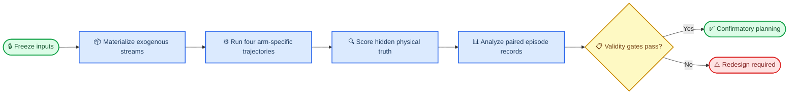

# Experiment 002 design-validation pilot

_Frozen protocol for the 9,600-episode feasibility pilot_

---

> ⚠️ **Evidence boundary:** This pilot evaluates design feasibility in a one-dimensional synthetic generator. It is not a confirmatory superiority study, flight-safety evidence, or an estimate of operational fault prevalence.

## 🎯 Objective and experimental unit

The pilot tests whether four controller paths can be compared without truth leakage, controller-dependent sampling, step-level pseudoreplication, or evaluator–gate circularity. The experimental unit is one `stratum × root_seed` block. Each block runs `R`, `D`, `PS`, and `PD` once in a randomized order.

| Arm | Controller path | Policy input | Gate input | Role |
| --- | --- | --- | --- | --- |
| `R` | Deterministic reference | Primary observation | None | Descriptive benchmark |
| `D` | Frozen learned direct | Primary observation | None | Primary comparator |
| `PS` | Frozen learned with protection | Primary observation | Same primary observation | Mediation contrast |
| `PD` | Frozen learned with protection | Primary observation | Equal-spec monitor observation | Primary architecture |

Controllers receive observation objects only. Hidden truth, true fault labels, latent actuator effectiveness, process disturbance, and evaluator outputs are prohibited controller and gate inputs.



## 📋 Canonical pilot population

The pilot contains exactly `400` root seeds in each of six fixed-weight strata. Every stratum contributes `1/6` to standardized pilot estimands. The three navigation mixtures contain exactly 200 range-bias and 200 dropout blocks in a deterministically shuffled manifest, so each component contributes `1/12` overall.

| ID | Stratum | Frozen composition |
| --- | --- | --- |
| `P0` | Nominal stochastic | 400 nominal blocks |
| `P1` | Primary navigation | 200 range bias + 200 dropout; primary only |
| `P2` | Monitor-only navigation | 200 range bias + 200 dropout; monitor only |
| `P3` | Shared-cause navigation | 200 range bias + 200 dropout; identical onset, duration, subtype, sign, and magnitude on both channels |
| `P4` | Persistent model upset | 400 in-memory learned-weight perturbations; immutable artifact unchanged |
| `P5` | Actuator degradation | 400 latent effectiveness schedules |

The combined primary-dropout plus actuator-degradation stratum is omitted from the pilot. No pilot result may be described as estimating the separate eight-stratum confirmatory population.

The canonical campaign size is:

```text
6 strata × 400 paired root seeds × 4 arms = 9,600 episodes
```

## ⚙️ Shared stochastic inputs and arm-specific truth

Each block uses NumPy `SeedSequence` with `PCG64DXSM` and the domain-separated key:

```text
(master=2002, partition, stratum, replicate, stream)
```

Named streams are `initial_state`, `process_disturbance`, `primary_sensor`, `monitor_sensor`, `fault_parameters`, and `arm_run_order`. The same initial state, physical-time disturbance path, channel innovations, latency draws, fault parameters, and run-order draw are reused across arms. Each arm propagates its own truth from its executed actions. Sensor values are therefore computed from that arm's lagged truth plus a shared innovation; controller-dependent measurements and truth trajectories are never copied between arms.

Primary and monitor channels share nominal specifications: range noise `Normal(0, 0.25²)` m, velocity noise `Normal(0, 0.01²)` m/s, range quantization `0.05` m, velocity quantization `0.002` m/s, and latency of either `0` s with probability `0.9` or `1` s with probability `0.1`. Nominal innovations remain independent by channel. A shared-cause fault couples only the declared corruption and missing-data transition.

## 🔍 Independent safety and mission evaluation

Dynamics include hidden achieved acceleration `a`, actuator effectiveness `e`, command `u`, disturbance `w`, and first-order lag `τ=0.5 s`:

```text
r_dot = v
v_dot = a + w
a_dot = (e*u - a) / τ
p_dot = -k*abs(a)
```

The production propagator is the exact float64 solution on intervals with constant command, effectiveness, and disturbance. It splits at disturbance knots, actuator-fault boundaries, and propellant depletion. Thrust-generated acceleration becomes zero immediately at depletion. Continuous interval extrema and the earliest collision crossing at `r=1 m` are solved independently of telemetry sampling.

The evaluator is a separate module that does not import the runtime gate. At each truth-evaluation time it computes reachable stopping distance under maximum separation command, current achieved acceleration, current latent effectiveness, remaining propellant, actuator lag, and the frozen adverse disturbance `w=-0.006 m/s²`. If stopping is not reachable before propellant depletion, distance is infinite. The braking margin is:

```text
M_reach = r_true - 1 m - reachable_stopping_distance
```

Physical hazard is continuous collision or a connected negative-margin exposure of at least `1 s`. Margin-crossing duration is reconstructed on a fixed truth grid by linear crossing interpolation; the runtime gate instead uses a deliberately simpler observation-only nominal one-step guard.

Sustained success requires no physical hazard, no propellant depletion, final propellant at or above `0.10`, true range continuously within `5–8 m`, and absolute true speed continuously at or below `0.06 m/s` throughout `[540, 600] s`. Collision is absorbing; every other episode runs to `600 s`.

## 🔄 Recovery state and precedence

The recovery corridor is calibrated once from 500 disjoint nominal reference-arm seeds. Thresholds are outward-rounded expanded `0.1%/99.9%` truth quantiles for range, absolute velocity, and propellant. The resulting artifact is hashed before pilot execution and is evaluator-only.

The frozen state precedence is:

```text
FAILED > UNAFFECTED > RECOVERED > GRACEFUL_DEGRADED > NOT_RECOVERED
```

`RECOVERED` requires a corridor exit, affected-component restoration, a qualifying re-entry beginning within `180 s` of first exit, 30 continuous seconds inside, and later sustained mission success. Persistent model corruption is never recovered without model restoration. Protected safe mission completion under permanently latched fallback is `GRACEFUL_DEGRADED`. Recovery-favorable by 180 seconds includes `UNAFFECTED` and `RECOVERED`, not graceful degradation.

## 🔒 Policy and execution freeze

The learned policy is a nine-parameter float64 bounded smooth linear policy with a `tanh` action transform. Ordered observation-only features, imputation, normalization, architecture, training objective, optimizer budget, primary optimizer seed, early-stopping rule, and validation-only lexicographic selection are recorded in the policy manifest. Training uses only disjoint nominal train-fit and train-stop partitions. Validation selects once without refitting. Fallback actions, gate labels, monitor observations, pilot outcomes, and future confirmatory outcomes are prohibited training inputs.

Before any pilot episode, the freeze manifest hashes:

- source files and working-tree diff identity
- dependency lock and Python patch target
- generator configuration and protocol
- policy bytes and policy manifest
- train, stop, validation, calibration, pilot, and future-reservation seed manifests
- all 2,400 scenario hashes and QC subsets
- recovery corridor and analysis code
- progression criteria and append-only amendment rules

The pilot runner refuses execution after any frozen-input hash drift.

## ✅ Validation and progression rules

Numerical integration verification and controller command-rate sensitivity are separate tests:

1. **Numerical verification:** keep decision times and open-loop inputs fixed; compare exact propagation with float64 RK4 at 4,096 substeps. Maximum state error must be `≤1e-10`, with unchanged event classes.
2. **Command-rate sensitivity:** rerun a manifest-frozen 40 blocks per stratum at `1`, `0.5`, and `0.25 s` controller periods while preserving physical fault times and the `0.25 s` exogenous path. Collision, physical-hazard, and success classes must remain unchanged; minimum-range change must be `<0.05 m`; absolute propellant-use change must be `<0.01` initial-fraction units.

Other validity gates require exact manifests and mixtures, 9,600 unique expected cells, at least 396 complete blocks per stratum, zero prohibited truth access, evaluator–gate independence, equal channel specifications, proposal identity for matched inputs, and exact same-platform replay of 40 frozen blocks per stratum.

Pilot controller-effect direction is reported but is not a progression gate. Confirmatory planning additionally requires requirements-based paired power of at least 95% for each H1 and H2 test at a fixed size between 1,000 and 2,000 seeds per stratum, plus a prospectively approved nuisance model for the pilot-omitted combined-fault stratum. The pilot cannot supply that missing nuisance quantity by assumption.

## 📦 Artifacts and scope limits

Machine-readable outputs are one episode row per expected cell in `results/experiment-002/episodes.jsonl`, paired analysis in `analysis.json`, QC in `qc.json`, run provenance in `run-manifest.json`, and checksums in `SHA256SUMS`. The concise human-readable result is `report.md`.

The study remains a one-dimensional engineering stress test. It omits orbital coupling, attitude, plume/contact dynamics, flight-qualified estimation, hardware timing, and real fault prevalence. A successful pilot validates the experimental design and software evidence pipeline only.
