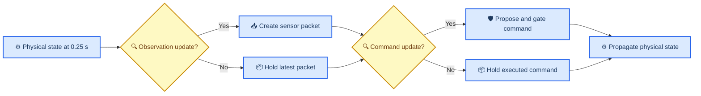

# Experiment 002b corrective validation amendment

_Replacement validation methodology for the invalid Experiment 002 command-rate invariance gate_

---

> 📌 **Historical boundary:** Experiment 002 remains unchanged, including its pilot outcomes, freeze manifest, failed gate, and `do_not_proceed` decision. Experiment 002b is a new version with disjoint seeds and separate provenance.

## 🎯 Corrective conclusion

The prior command-rate check varied command update and observation sampling together, then required classifications and continuous trajectories to remain nearly identical. That requirement was scientifically invalid for different sampled-data closed-loop systems. A shorter command hold changes the controller action sequence; a shorter observation period changes packet age and fault-detection time; the gate also changes its lookahead with command period.

The completed diagnostic used as amendment evidence found no collision or physical-hazard classification changes on its frozen subset. Success flips and large absolute range/propellant changes arose from changed command hold, observation sampling, gate lookahead, and closed-loop response. Experiment 002b therefore validates the method rather than redesigning the controller to reproduce a different sampled-data trajectory.

## 📋 What 002b validates

| Question | Method | Progression role |
| --- | --- | --- |
| Does the existing operational setting show a safety defect? | `150` new `PD` seeds per stratum at `1.0 s` command and observation periods | Required gate |
| Does exact propagation match an independent reference for full traces? | `24` complete fixed-command traces through exact and adaptive `DOP853` propagation | Required gate |
| Which timing factor explains changed behavior? | Paired `3 × 3` command-period/sampling-period grid on `12` new seeds per stratum | Mechanism and integrity gate; no rate support claim |
| Are propellant requirements retained? | Final reserve and depletion checks on every 002b episode | Required gate |

The operational sample is prospective. With zero events in `150` independent seeds, the one-sided exact `95%` upper bound is `0.01977`, below the frozen `0.02` per-stratum margin. The mixed navigation strata retain exact subtype balance.

## ⚙️ Timing design

All nine combinations of command period and observation period in `{1.0, 0.5, 0.25} s` are executed on shared exogenous scenarios. The `1.0 s/1.0 s` cell is the diagnostic reference. Proposed/executed commands, gate reasons, packet identities and ages, sensor values, fault timing, minimum range, classifications, and propellant use are machine-readable.

No exact trajectory, range, fuel, or success identity is required across timing cells. The `0.5 s` and `0.25 s` settings are diagnostic only.

## 🔬 Numerical replay design

The prior numerical check exercised only three one-second fixtures. Experiment 002b instead replays complete `600 s` command histories. Production exact propagation and an independent adaptive ODE solver receive identical timestamped commands, disturbance knots, actuator-effectiveness boundaries, and initial states.

Acceptance requires:

- Maximum boundary-state or evaluator-metric error `≤1e-10`
- Identical collision classification
- Identical physical-hazard classification
- Identical propellant-depletion classification
- Identical sustained-success classification

The fixed suite includes operational controller traces plus maximum-closing, maximum-separating, and alternating-extrema traces so collision and depletion behavior are exercised rather than inferred from benign fixtures.

## ✅ Decision logic

A passing amendment qualifies only the existing `1.0 s` operational configuration within the frozen six-stratum synthetic generator. It does not reverse or rewrite the Experiment 002 record, qualify faster command periods, establish flight safety, or authorize the full confirmatory campaign.

If 002b passes, the next step is the separate combined-fault nuisance/information study. If it fails, the observed gate must be investigated before any further campaign planning.

The full protocol and outcome-opening rule are frozen in [`experiments/002b/preregistration.md`](../experiments/002b/preregistration.md).
