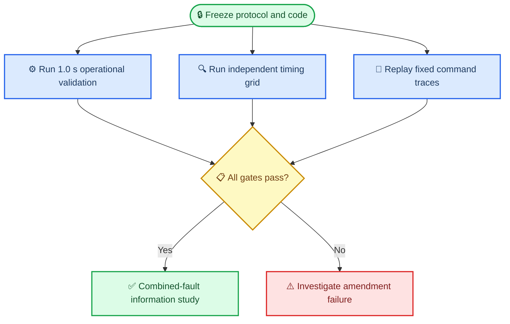

# Experiment 002b preregistration

_Corrective amendment to the Experiment 002 validation methodology_

---

> ⚠️ **Evidence boundary:** This amendment validates the frozen protected learned controller (`PD`) at the existing `1.0 s` command and observation periods in the six-stratum synthetic generator. It is not flight-safety evidence, a multi-rate qualification, or a confirmatory controller comparison.

## 🎯 Objective and historical boundary

Experiment 002b corrects an invalid Experiment 002 quality-control rule. The prior rule demanded near-invariance when both command update period and sensor sampling period changed. Those runs are different sampled-data closed-loop systems: command hold, observation age, gate lookahead, model-upset application time, and fault response can all change legitimately.

The completed diagnostic supplied as amendment evidence found zero collision or physical-hazard classification changes on its frozen subset. Its success flips and large absolute range/propellant changes are treated as expected closed-loop timing effects, not numerical integration error. The original Experiment 002 protocol, freeze, seed manifests, results, report, and `do_not_proceed` decision remain unchanged historical evidence.

The amendment makes no controller change. The existing `1.0 s` period is the only currently qualified operational command period. No broader flight timing requirement is asserted.

## 📋 Prospective design

The study has three disjoint components. Each uses a new `SeedSequence` partition domain beyond every Experiment 002 train, stop, validation, calibration, pilot, replay, and rate-subset domain.

| Component | Partition code | Independent units | Executions | Purpose |
| --- | ---: | ---: | ---: | --- |
| Operational validation | `21` | `150` seeds × `6` strata | `900` `PD` episodes | Qualify the existing `1.0 s` command/observation configuration |
| Rate decomposition | `22` | `12` seeds × `6` strata | `648` `PD` episodes | Descriptive `3 × 3` command-period/sampling-period mechanism study |
| Fixed-command replay | `23` | `1` seed × `6` strata | `24` complete traces | Compare production exact propagation with an independent high-accuracy reference |

Mixed navigation strata are exactly balanced: `75/75` bias/dropout in operational validation and `6/6` in rate decomposition. The experimental unit is a root-seed scenario. Timing configurations are paired within each rate-decomposition scenario; command steps are never treated as independent observations.



## 📊 Sample-size determination

The operational sample size is requirement-based, not chosen from amendment outcomes. For zero observed physical hazards in `n` independent seeds, the one-sided exact `95%` upper confidence bound is:

```text
upper = 1 - 0.05^(1/n)
```

The smallest integer with `upper < 0.02` is `149`. The frozen design uses `150` per stratum so each mixed stratum can retain exact `75/75` subtype balance. If a physical hazard occurs, the zero-event gate fails; the sample is not enlarged after outcomes.

The completed rate diagnostic did not provide an outcome-blind paired sustained-success discordance estimate suitable for powering the required `−0.03` multi-rate margin. Success flips were already known to occur for legitimate timing reasons. A multi-rate claim therefore cannot be sized honestly from the available nuisance evidence without opening or guessing the target outcomes. The smallest defensible amendment is a `12`-seed-per-stratum mechanism study, large enough to balance mixed subtypes and observe repeated fault responses, but explicitly not powered for rate qualification.

## ⚙️ Independent timing decomposition

The physical disturbance and sensor innovation grid remains `0.25 s`. Command period and observation period vary independently over `{1.0, 0.5, 0.25} s`:

- The observation period determines when a new primary and monitor packet is sampled
- The command period determines when the policy and gate recompute and how long the executed command is held
- A command update between sensor samples reuses the most recent packet and records packet age
- Gate lookahead uses the command period, as it does in the production controller
- Physical fault times remain unchanged across all paired timing cells

Every rate-decomposition command record contains proposed and executed commands, gate reason, override state, primary/monitor packet identities and sample times, packet ages and values, fault-active status, and model-upset application status. Every episode record contains first post-fault sensor samples, first post-fault command, first override, first executed-command change, minimum range, physical hazard, collision, success, depletion, and propellant use.

Closed-loop timing cells are compared descriptively with `1.0 s/1.0 s`. Exact trajectory identity, absolute range identity, absolute fuel identity, and success identity are prohibited progression gates.

## 🔬 Full fixed-command numerical replay

Each of six disjoint replay scenarios supplies four complete `600 s` timestamped command traces:

1. Frozen `PD` commands generated at the operational `1.0 s` periods
2. Continuous maximum closing command
3. Continuous maximum separating command
4. Alternating command extrema

The same trace, disturbance knots, actuator-effectiveness boundaries, initial state, and termination rules are replayed through:

- The production float64 exact propagator
- An independently implemented adaptive SciPy `DOP853` ODE reference with `rtol=2.5e-14` and `atol=1e-15`

All state boundaries and evaluator metrics are compared. The gate requires maximum state or metric error `≤1e-10` and identical collision, physical-hazard, propellant-depletion, and sustained-success classifications in all `24` traces.

## ✅ Prospective acceptance criteria

Experiment 002b passes only if every condition below holds:

- Pre-outcome dependency, lint, test, compile, legacy safety, whitespace, and publication-boundary scans pass
- The freeze self-hash and every frozen input hash verify before execution and analysis
- Every 002b root seed is unique and disjoint from all Experiment 002 partitions
- There are zero controller, invalid-action, or numerical failures
- Full fixed-command numerical replay passes the `1e-10` error and classification gates
- Each operational stratum has exactly `150` episodes, zero physical hazards, zero collisions, and a one-sided exact `95%` physical-hazard upper bound below `0.02`
- Every operational and diagnostic episode retains final propellant `≥0.10` with zero depletion
- The complete `3 × 3` timing grid and command-event evidence pass integrity checks
- The full confirmatory campaign and separate combined-fault study remain unexecuted

Sustained success is reported at the operational setting but is not used as an identity gate across timing systems. No support is claimed for command periods below `1.0 s`. If future work claims such support, it must be prospectively sized and require the paired `PD` one-sided `95%` hazard-increase upper bound below `+0.02`, the paired sustained-success-change lower bound above `−0.03`, and reserve/depletion requirements at every claimed period.

## 🔒 Freeze and outcome-opening rule

Protocol, sample size, seed manifests, implementation, reference method, command patterns, analysis, and acceptance criteria are hashed before outcomes run. Execution refuses frozen-input drift and refuses to overwrite existing output. Any required post-freeze implementation change abandons this version and requires a new disjoint amendment partition; sample size is never increased because of observed outcomes.

## 🚫 Scope exclusions

The `32,000`-episode confirmatory campaign remains blocked and is not run. The separate combined-fault nuisance/information study is not run. No result in this amendment establishes flight safety, operational fault prevalence, multi-rate support, or confirmatory controller superiority.
