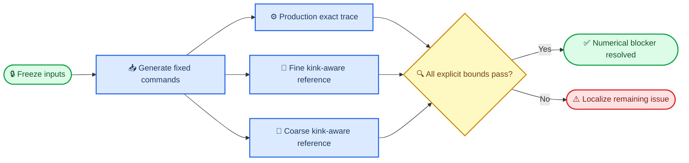

# Experiment 002c preregistration

_Numerical-only corrective amendment following the frozen Experiment 002b failure_

---

> ⚠️ **Evidence boundary:** Experiment 002c tests numerical agreement for fixed command
> histories. It does not rerun or extend the operational, timing-rate, combined-fault, or
> confirmatory mission campaigns and does not modify any Experiment 002 or 002b result.

## 🎯 Objective and historical diagnosis

Experiment 002b failed its universal `1e-10` replay gate while all required classifications
matched. The completed failure diagnosis found that smooth state propagation was accurate, but
the independent reference integrated propellant through acceleration-zero kinks without splitting
the numerical solve. Small propellant errors shifted depletion times; the frozen instantaneous
post-depletion acceleration reset then amplified those errors into state and duration differences.
The largest 002b discrepancies occurred in maximum-separating and alternating-extrema traces,
whereas all smooth maximum-closing traces passed. No controller defect was indicated.

Independent source and result inspection before this freeze confirmed that diagnosis and identified
two additional validation defects:

- Experiment 002b omitted boundary timestamps, explicit event times, maximum interval range,
  maximum interval absolute velocity, and `braking_unreachable` from its comparison
- Production computed collision-terminated interval extrema over the unused remainder of the
  interval, after the collision time

Experiment 002c corrects only those numerical defects. The production change truncates extrema at
the actual collision time and has focused regression tests. Dynamics and controllers are otherwise
unchanged.

## 📋 Prospective replay design

The replay uses partition code `24`, which is disjoint from all Experiment 002 and 002b seed
domains. It contains one new root scenario per frozen stratum and four complete `600 s` command
patterns, for exactly `24` traces:

1. Frozen protected-controller commands generated at the existing `1.0 s` command and observation
   periods
2. Continuous maximum-closing command
3. Continuous maximum-separating command
4. Alternating command extrema

This is deterministic numerical coverage, not a population-rate estimate. The case count will not
be enlarged after outcomes are opened. The protected-controller episode used to generate each
`pd_operational` command history is an input-generation step within the replay, not a new
operational validation campaign.

## 🔬 Independent reference and comparison boundary

The independent reference uses adaptive `DOP853` integration but does not call the production exact
propagator. When achieved acceleration and target acceleration have opposite signs, a terminal
acceleration-zero event ends the first smooth phase. Propellant is integrated in each phase as the
known-sign expression rather than as an unsplit absolute-value derivative. Collision and depletion
events remain active in every phase, and the earliest event controls termination. Depletion retains
the frozen instantaneous reset to zero achieved acceleration so only the integration method differs.

Production traces use the existing production offline evaluator. Reference traces use a separately
implemented evaluator with the same frozen definitions. Agreement is therefore not inferred from a
shared evaluator. The comparison explicitly records:

- Every boundary timestamp, range, velocity, achieved acceleration, and propellant value
- Every interval minimum range, maximum range, and maximum absolute velocity
- Collision and depletion occurrence, times, ordering, and raw root residuals
- Minimum range, minimum braking margin, maximum negative-margin duration, first goal-entry time,
  final-window dwell fraction, and `braking_unreachable`
- Collision, physical-hazard, propellant-depletion, and sustained-success classifications

The fine reference uses `rtol=2.5e-14`, `atol=1e-15`, and maximum step `1/8` of each propagation
piece. The coarse reference independently uses `rtol=1e-13`, `atol=4e-15`, and maximum step `1/4`
of each piece. Coarse-to-fine disagreement must remain within `25%` of every applicable acceptance
bound. Raw event residuals from both reference settings must remain within the full residual bounds.

## ✅ Prospective acceptance criteria

Event ordering, the four classifications, `braking_unreachable`, optional-event presence, and record
alignment must be identical. Continuous comparisons use the following unit-specific bounds; no
single unit-mixing maximum is used:

| Quantity | Production vs. fine reference | Coarse vs. fine reference |
| --- | ---: | ---: |
| Boundary range, range extrema, minimum range, braking margin | `1e-8 m` | `2.5e-9 m` |
| Boundary velocity and maximum absolute velocity | `1e-10 m/s` | `2.5e-11 m/s` |
| Achieved acceleration | `1e-12 m/s²` | `2.5e-13 m/s²` |
| Propellant fraction | `1e-10` | `2.5e-11` |
| Boundary/event times and duration metrics | `2e-7 s` | `5e-8 s` |
| Dimensionless final-window dwell fraction | `1e-10` | `2.5e-11` |
| Raw collision residual | `1e-10 m` | Residual difference `≤2.5e-11 m` |
| Raw depletion residual | `1e-12` fuel fraction | Residual difference `≤2.5e-13` |

Both coarse and fine raw collision and depletion residuals must also satisfy the full residual bounds.
The amendment passes only if all `24` traces satisfy every criterion, all command-history generation
completes without controller or numerical failure, the new seeds are manifest-complete and
disjoint, pre-outcome validation passes, and the freeze verifies.

## 🔒 Freeze and outcome-opening rule

Protocol, source, tests, configuration, seed manifests, thresholds, solver settings, policy inputs,
historical evidence hashes, and validation evidence are frozen before the replay runs. The execution
refuses pre-existing primary outputs. Analysis outputs are write-once. Any post-freeze change to
implementation, seeds, solver settings, case count, or thresholds abandons Experiment 002c and
requires a new amendment and untouched partition. A failing outcome is recorded without rerun or
threshold change.

Experiment 002b operational and rate evidence is carried only by immutable file hashes and direct
references to its frozen analysis and report. Those campaigns are not rerun. The `32,000`-episode
confirmatory campaign and combined-fault study remain unexecuted.

## 🚫 Decision boundary

A pass resolves only the fixed-command numerical blocker. The exact next scientific blocker before
the confirmatory study is the prospectively designed combined-fault nuisance/information
requirement. A failure leaves the confirmatory study blocked and must be localized by quantity,
pattern, stratum, event phase, and convergence status from the recorded comparison fields.
